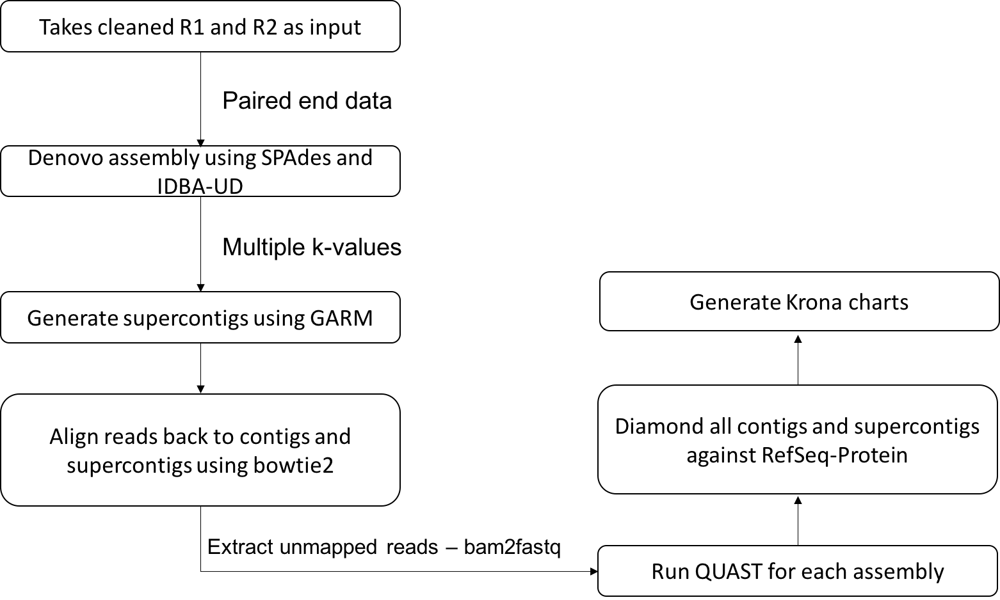

# metaViC 
<html>
<head>
<h3>
metaViC : Virus metagenomics pipeline for unknown host or in absence of a host genome
</h3>
</head>

<body>

 We have developed an in-house metagenomics pipeline that we apply to the samples when we have sample from unknown hosts or if the host genome sequence is not sequenced. In the absence of the reference genome it is difficult to determine how to remove the host sequences from the sample. The pipeline described here can be applied directly to any virus metagenomics study. 

 This metagenomics pipeline is mainly divided into two major components. The first component deals with cleaning and removing non-viral contents from the reads and the second with de-novo assembly. 

<ol type="1">
  <li>Cleaning – removing known higher level organism and bacterial reads</li>

The first step of the cleaning pipeline is to remove the adapters using trim_galore (Krueger). In some cases of metagenomics sample preparation for sequencing ribosomal RNA (rRNA) removal might not be removed before sequencing the sample. In such cases and also in cases it is advisable to remove the rRNAs in silico using RiboPicker (Schmieder et al., 2012). After this, DIAMOND (Buchfink et al., 2014) can be run for each read against the refseq protein database for each file. Krona charts (Ondov et al., 2011) are generated for each DIAMOND output file that describes the read based classification of the sample. The DIAMOND results are then converted to a BLAST tabular output and the Genbank Identifier (GI) column from the output is extracted. GIs are mapped back to NCBI taxonomy databases to extract the corresponding taxonomy and division ID. In our case, we are only interested in the sequences that match viruses, environmental sequences and the sequences that do not match anything in the database. Therefore, any read that is matching protein sequences originating from bacteria, invertebrates, mammals, rodents, phages, plants, vertebrates, primates and synthetic constructs are identified based on the division ID and are filtered from the sample files. Finally, the sample files are properly paired using Prinseq-lite.pl (Schmieder et al., 2011). These reads can then be submitted to the next stage of the pipeline.

  <li>Denovo assembly</li>
</ol>

 

Sequence reads from the previous step of the pipeline can be submitted to this script that carries out the de-novo assembly using SPAdes (Bankevich et al.; Nurk et al., 2013) and IDBA-UD (Peng et al., 2012) with the k-mer values 31,55,77,99 for SPAdes and a range of the k-mer values starting with minimum k of 31 to maximum k of 99 for IDBA-UD.

The assembled contigs from two assembly tools are then merged using GARM (Soto-Jimenez et al., 2014), an assembly merging pipeline that uses mummer to find overlaps between two assemblies and joins them. Reads are aligned back to the contigs (larger than 200) and supercontigs using bowtie2 (Langmead and Salzberg, 2012) and unmapped reads are extracted using bam2fastq. In order to check the assembly quality, a QUAST (Gurevich et al., 2013) analysis is performed for each contig assembly and for supercontigs. Contigs longer than length of 200 and supercontigs generated by GARM are merged and classified using DIAMOND against refseq protein database. Kronatools are used to create interactive HTML output to visualise the BLAST tabular output formatted results generated by DIAMOND.

 
This pipeline has been applied to field samples of midges from the Scotland, fecal samples of the bats from Brazil, insects from Antarctica.

</body>
</html>

</body>
</html>

